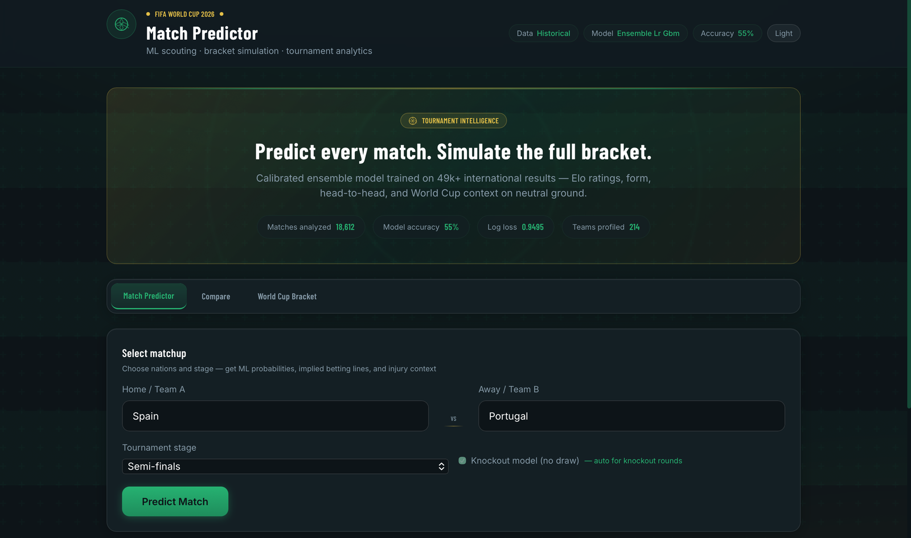
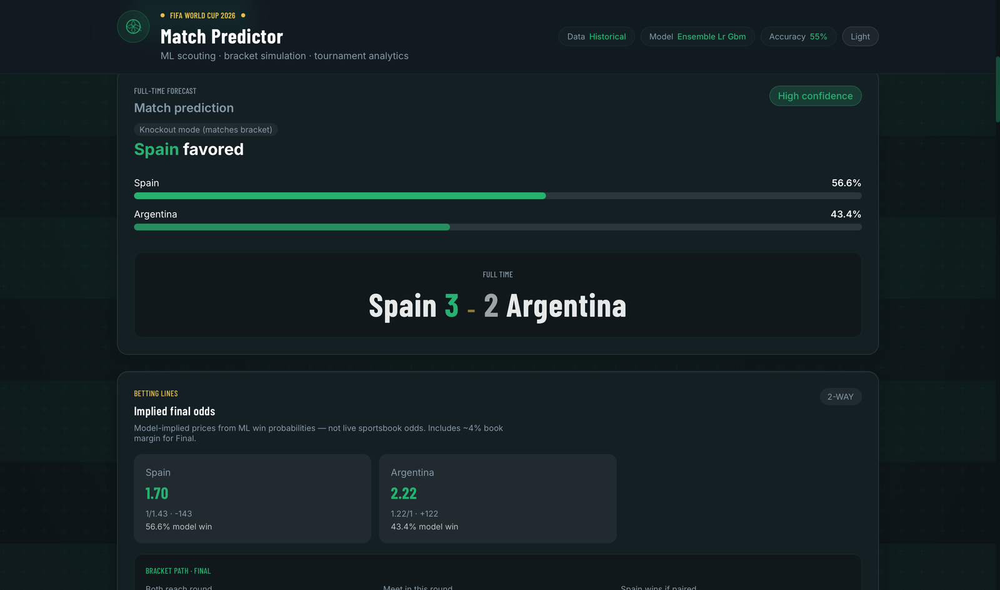
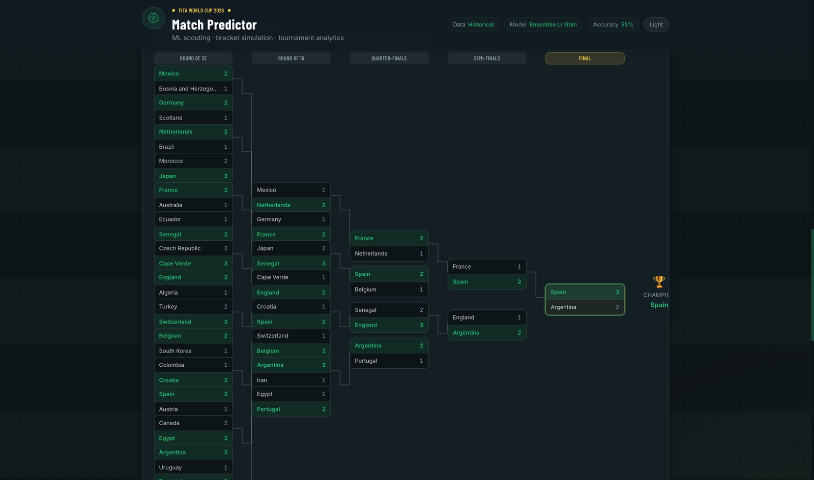
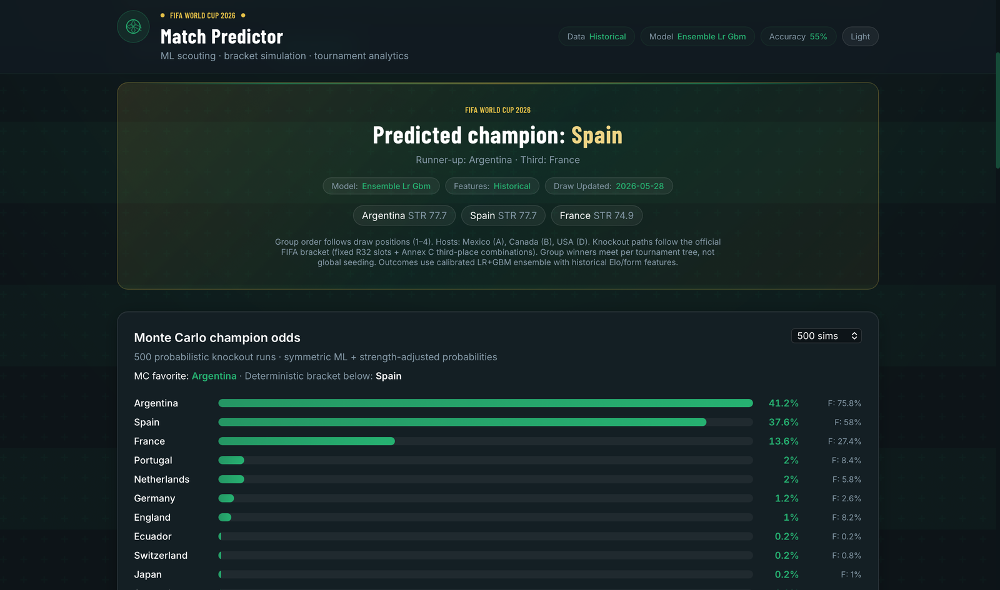
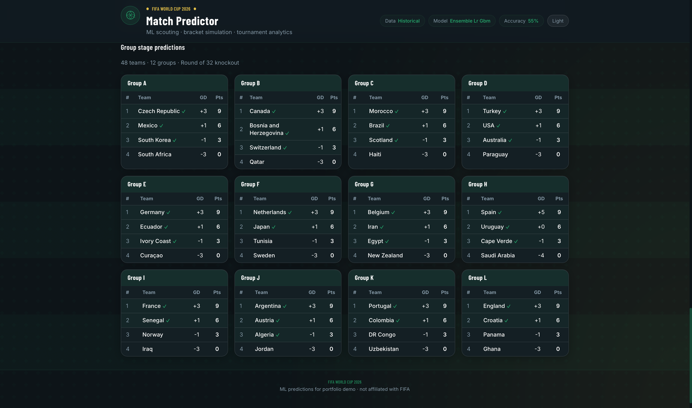
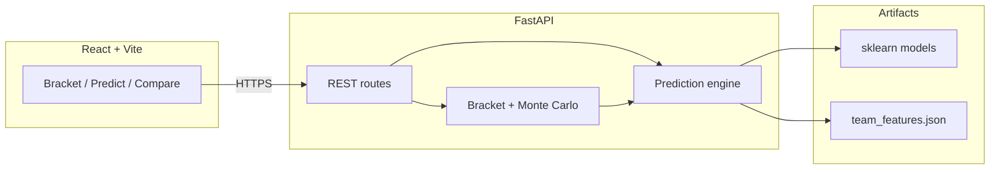

# World Cup 2026 Match Predictor

[](https://www.python.org/)
[](https://fastapi.tiangolo.com/)
[](https://react.dev/)
[](LICENSE)

Full-stack football analytics app: calibrated match probabilities, scorelines, tactical breakdowns, a **48-team knockout bracket**, and Monte Carlo champion odds — built as a portfolio project.

> 🎯 **Track record: the model correctly predicted all four semi-finalists and both finalists of the real 2026 FIFA World Cup.**

| | |
| --- | --- |
| **Repository** | [github.com/kunalbhasin135/World_Cup_2026_Predictor](https://github.com/kunalbhasin135/World_Cup_2026_Predictor) |
| **Live demo** | *Coming soon — [deploy guide](docs/DEPLOY.md)* |
| **API docs** | *After deploy: `https://YOUR_API.onrender.com/docs`* |

## Highlights

- **ML pipeline** on ~49k international results with point-in-time features (Elo, form, H2H, venue, rest) — no training leakage
- **Three models:** calibrated LR + GBM ensemble (W/D/L), knockout binary classifier, Poisson scorelines
- **Tournament engine** using official FIFA paths (M73–M104) and Annex C third-place combinations (495 scenarios)
- **React UI:** bracket tree, what-if knockout overrides, compare mode, model transparency, bracket PNG export

## Screenshots

| Match predictor | Prediction result |
| :---: | :---: |
|  |  |

| 48-team knockout bracket | Monte Carlo champion odds |
| :---: | :---: |
|  |  |

| Group-stage predictions |
| :---: |
|  |

## Tech stack

| Layer | Technology |
| --- | --- |
| Backend | Python 3.13, FastAPI, Uvicorn |
| ML | scikit-learn (LR, GBM, Poisson), pandas |
| Frontend | React 19, Vite, Tailwind CSS v4 |
| Data | [martj42/international_results](https://github.com/martj42/international_results) |

## Features

<details>
<summary><strong>Match predictions</strong></summary>

- Win / draw / loss probabilities (calibrated **LR + GBM ensemble**)
- **Model-implied betting odds** (decimal, fractional, American)
- **Bracket-path context** — P(two teams meet in a knockout round) via Monte Carlo
- Squad injuries & availability (curated JSON + optional API-Football sync)
- Dedicated **knockout** model (no draw)
- **Poisson** expected goals and scorelines
- Model transparency panel, player analysis, predicted scorers

</details>

<details>
<summary><strong>Tournament simulation</strong></summary>

- Full **48-team** group + knockout bracket
- **Monte Carlo** champion odds (500+ simulations)
- **What-if** — force R32 winners and re-run
- Exportable bracket PNG, SVG knockout connectors

</details>

<details>
<summary><strong>Compare mode & evaluation</strong></summary>

- Side-by-side predictions for 2–4 matchups
- Jupyter notebook: calibration plots and World Cup backtest (`notebooks/model_evaluation.ipynb`)

</details>

## Architecture



## Quick start

### Backend

```bash
cd backend
python -m venv .venv
source .venv/bin/activate   # Windows: .venv\Scripts\activate
pip install -r requirements.txt

# First time: download data + train (~few minutes)
python scripts/build_features.py
python scripts/train_model.py

uvicorn app.main:app --reload --port 8000
```

API docs: http://localhost:8000/docs

### Frontend

```bash
cd frontend
npm install
npm run dev
```

Open http://localhost:5173 (proxies API via Vite dev server, or set `VITE_API_URL=http://localhost:8000`).

## API

| Method | Path | Description |
| --- | --- | --- |
| `POST` | `/predict` | Match prediction + odds + squad + optional round context |
| `POST` | `/predict/compare` | Compare 2–4 matchups |
| `GET` | `/squads/status` | All squad injury feeds |
| `GET` | `/squads/{team}/status` | Injuries for one nation |
| `GET` | `/bracket/predictions` | Deterministic full bracket |
| `GET` | `/bracket/monte-carlo?simulations=500` | Champion probability distribution |
| `POST` | `/bracket/what-if` | Bracket with forced knockout winners |
| `GET` | `/data/status` | Feature + model metadata |
| `GET` | `/health` | Health check for deploy |

## Deployment

Free-tier hosting: **Render** (API) + **Vercel** (UI). Step-by-step instructions: **[docs/DEPLOY.md](docs/DEPLOY.md)**.

Docker (API only):

```bash
docker build -t wc2026-api .
docker run -p 8000:8000 wc2026-api
```

## Project structure

```
World_Cup_2026_Predictor/
├── backend/
│   ├── app/services/ml/          # Training dataset, model loader
│   ├── app/services/prediction/  # Engine, probability, score models
│   ├── scripts/                  # build_features, train_model
│   └── models/trained/           # Generated locally / on deploy (gitignored)
├── frontend/src/components/      # Bracket, compare, transparency UI
├── data/
│   ├── bracket/                  # Official draw + knockout templates
│   ├── profiles/                 # Scouting-style team JSON
│   └── raw/                      # results.csv (downloaded, gitignored)
├── docs/                         # DEPLOY.md, data-sources, screenshots
└── notebooks/model_evaluation.ipynb
```

## Models

| Model | Purpose | Typical metrics |
| --- | --- | --- |
| Calibrated LR + GBM ensemble | W/D/L (group stage) | ~55% accuracy, log loss ~0.95 |
| Binary logistic regression | Knockout winner | ~70% accuracy |
| Poisson regression | Expected goals | MAE ~1.0 goals |

See [docs/data-sources.md](docs/data-sources.md) for datasets and attribution.

## Limitations

- Draw uses the **official Dec 2025** group file; play-off slots updated Mar 2026
- Player squads are curated/seeded, not live FIFA registrations
- Draws are hard to predict (~24% base rate); knockouts use a separate no-draw model
- Not betting advice — educational / portfolio use only

## License

[MIT](LICENSE) — portfolio and educational use.
